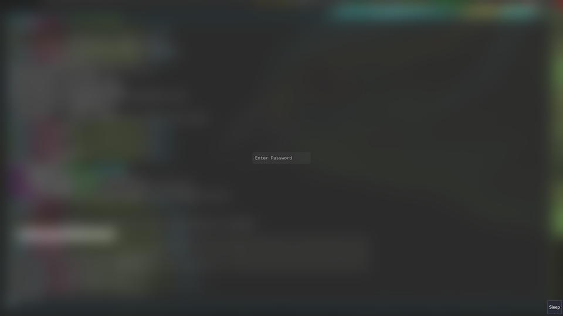

Padlock
=======
This is a very simple approach of a screen locker for i3wm (and possibly other WMs/DEs).


Building
--------
This application only requires two dependencies: *gtkmm3* and *pam*.
```bash
git clone https://github.com/proxict/padlock.git
cd padlock
mkdir -p build && cd build
cmake ..
make
```

Installing
----------
First, build the padlock according to the build instructions above.
```bash
make install # run with root privileges
```

Basic usage
-----------
```bash
padlock image.png
```
The way I use this application is that I take a screenshot of my screen, blur the screenshot and use the blurred image as an input for the padlock.
For that I have two simple scripts:  
screenshot: *(requires scrot)*
```bash
#!/bin/bash

scrot $(mktemp).png -e 'ls $f'
```
blur: *(requires imagemagick)*
```bash
#!/bin/bash

[ ! -f $1 ] && echo "Usage: blur " && exit 1

out=$(mktemp)
convert -scale 10% -blur 0x2.5 -resize 1000% $1 $out
command ls $out
```
Then, call the application like this:
```bash
padlock $(blur $(screenshot))
```

Disclaimer:
-----------
*Plese, keep in mind, this is not a cryptographically secure product as I'm using simple `std::string` without any custom allocators for the password input.
Nor there is any kind of `mlock` to prevent any part of the memory to be swapped to the swap area or dumped in case of a crash of the process. Use at your own risk.*

Also, the code is fairly old :)
